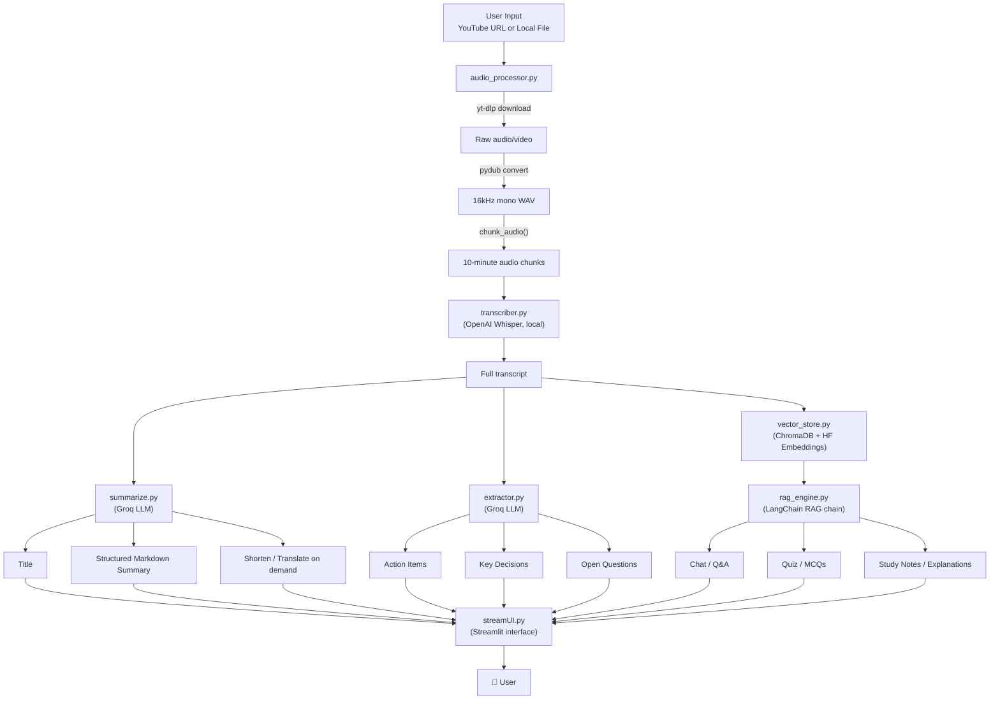
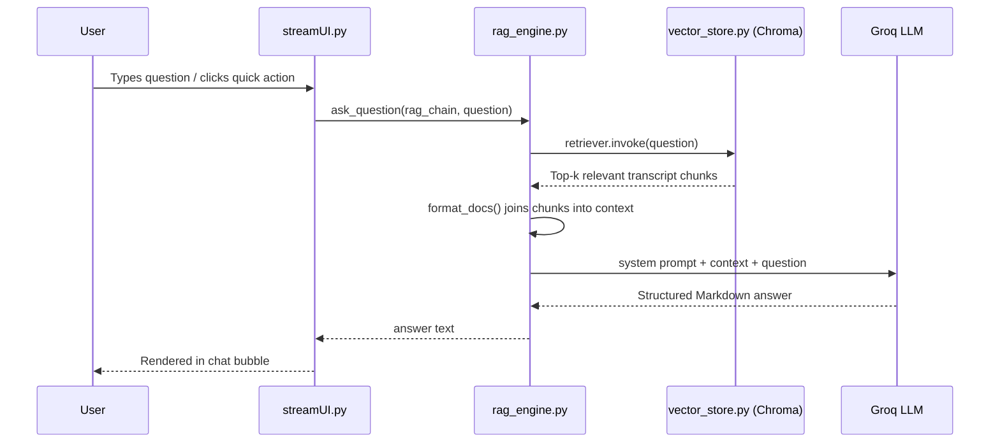

# 🎥 Video Agent — AI Meeting Intelligence & Chat Assistant

Turn any YouTube video or local recording into a **transcript, structured summary, extracted insights, and a chat assistant** you can ask questions to — powered by **Whisper**, **Groq LLMs**, and a **LangChain + ChromaDB RAG pipeline**, wrapped in a custom black & gold **Streamlit** UI.

---

## 📑 Table of Contents

- [Overview](#-overview)
- [Features](#-features)
- [Architecture](#️-architecture)
- [Chat / RAG Request Flow](#-chat--rag-request-flow)
- [Project Structure](#-project-structure)
- [Tech Stack](#-tech-stack)
- [Setup & Installation](#️-setup--installation)
- [Configuration Reference](#-configuration-reference)
- [Usage](#️-usage)
- [Pipeline Deep Dive](#-pipeline-deep-dive)
- [Troubleshooting & FAQ](#-troubleshooting--faq)
- [Known Limitations](#-known-limitations)
- [Roadmap](#-roadmap)
- [Contributing](#-contributing)
- [Acknowledgments](#-acknowledgments)
- [License](#-license)

---

## 📖 Overview

**Video Agent** takes a video (from YouTube or your own disk), transcribes it locally with Whisper, and hands the transcript to a set of Groq-powered LLM chains that:

- write a title and a clean, structured Markdown summary,
- pull out action items, key decisions, and open questions (with a "meeting analyst" framing, so it's especially strong on meeting/lecture-style content),
- and build a Retrieval-Augmented Generation (RAG) chat assistant that can answer questions, generate quizzes/MCQs, write study notes, or explain topics — always grounded in what was actually said in the video.

Everything is available both as a **Streamlit web app** (`streamUI.py`) and a **terminal CLI** (`main.py`), sharing the exact same underlying pipeline code.

---

## ✨ Features

**Input**
- Accepts a YouTube URL *or* a local video/audio file upload.
- Automatically detects which one you gave it — no manual mode switching needed.

**Transcription**
- Local, offline speech-to-text via OpenAI Whisper (no audio ever leaves your machine at this stage).
- Long recordings are automatically chunked (10-minute segments) so memory usage stays predictable regardless of video length.

**Understanding**
- 🏷️ AI-generated title (≤8 words).
- 📋 Structured Markdown summary — numbered sections, bold key terms, tables where useful, and a closing "Bottom line."
- ✅ Action items with **task / owner / deadline** extracted per item.
- 🔑 Key decisions made during the recording.
- ❓ Open/unresolved questions flagged for follow-up.

**Chat with your video**
- 💬 Free-form Q&A grounded strictly in the transcript (won't invent facts not present in the video).
- ⚡ One-click quick actions: 5-question quiz, 5 MCQs, "explain simply," key points, study notes.
- All chat responses follow the same structured-Markdown formatting rules as the summary.

**Post-processing**
- ✂️ Shorten the summary on demand.
- 🌐 Translate the summary into any language, preserving its Markdown structure.
- 📥 Download the transcript or summary as `.txt`.

**Session management**
- 🔄 Reset just the chat history.
- 🗑️ Clear downloaded audio files.
- 🆕 Full reset — wipes chat, audio files, and the vector database for a clean start with a new video.

---

## 🏗️ Architecture



**Two entry points, one shared pipeline:**
- **`main.py`** — a terminal-based CLI version of the full pipeline, useful for quick testing without the UI.
- **`streamUI.py`** — the full Streamlit web interface (tabs, chat, session tools, downloads).

Both call the exact same underlying functions in `core/` and `utlis/`, so behavior is identical either way.

---

## 🔄 Chat / RAG Request Flow

What actually happens when you type a question (or click a quick-action button) in the Chat tab:



The retriever pulls the **4 most relevant transcript chunks** (`k=4` in `get_retriever()`) for every request — so even a broad request like "make a quiz" pulls from the parts of the transcript ChromaDB judges most representative/relevant, not the whole transcript at once.

---

## 📁 Project Structure

```
Video Agent/
├── streamUI.py              # Streamlit web app (main interface)
├── main.py                  # CLI entry point (terminal-based pipeline)
├── requirements.txt         # Python dependencies
├── packages.txt              # System package for Streamlit Cloud (ffmpeg) — optional, cloud-only
├── .gitignore
├── .env                     # GROQ_API_KEY and optional overrides (not committed)
│
├── core/
│   ├── transcriber.py       # Whisper model loading + transcription
│   ├── summarize.py         # Title generation, summary, shorten, translate (Groq)
│   ├── extractor.py         # Action items / decisions / questions (Groq)
│   ├── vector_store.py      # ChromaDB vector store + HF embeddings
│   └── rag_engine.py        # LangChain RAG chain for chat/Q&A
│
├── utlis/
│   └── audio_processor.py   # Download, convert, and chunk audio
│
├── downloads/                # Generated at runtime — audio files (gitignored)
└── vector_db/                 # Generated at runtime — Chroma persistence (gitignored)
```

---

## 🧰 Tech Stack

| Layer | Technology | Role |
|---|---|---|
| UI | Streamlit | Web interface, session state, tabs, chat |
| Speech-to-text | OpenAI Whisper (local) | Audio → transcript |
| LLM | Groq API (`openai/gpt-oss-120b`) | Summaries, extraction, chat generation |
| RAG orchestration | LangChain | Prompt templates, retrieval chain (LCEL) |
| Vector database | ChromaDB | Stores transcript chunk embeddings |
| Embeddings | Hugging Face `sentence-transformers` (`all-MiniLM-L6-v2`) | Turns transcript chunks into vectors |
| Audio handling | yt-dlp, pydub, ffmpeg | Download, format conversion, chunking |
| Language | Python 3.10+ | — |

---

## ⚙️ Setup & Installation

### 1. Clone the repository
```bash
git clone https://github.com/<your-username>/<your-repo>.git
cd "Video Agent"
```

### 2. Create a virtual environment
```bash
python -m venv .venv
# Windows
.venv\Scripts\activate
# macOS/Linux
source .venv/bin/activate
```

### 3. Install dependencies
```bash
pip install -r requirements.txt
```

You'll also need **ffmpeg** installed on your system (required by `yt-dlp` and `pydub` for audio conversion):
- **Windows:** install via [WinGet](https://winget.run/) (`winget install ffmpeg`) or download from [ffmpeg.org](https://ffmpeg.org/download.html).
- **macOS:** `brew install ffmpeg`
- **Linux:** `sudo apt install ffmpeg`

### 4. Configure environment variables
Create a `.env` file in the project root:
```env
GROQ_API_KEY=your-groq-api-key-here

# Optional overrides
WHISPER_MODEL=small          # tiny | base | small | medium | large
FFMPEG_LOCATION=              # only needed if ffmpeg isn't on your system PATH
```

Get a free Groq API key at [console.groq.com](https://console.groq.com/).

### 5. (Optional) Speed up local development
Streamlit's dev file-watcher can be slow to start on machines with `transformers`/`torch` installed, since it scans every submodule on startup. If `streamlit run` takes unusually long to open, create `.streamlit/config.toml`:
```toml
[server]
fileWatcherType = "none"
```
Trade-off: you'll need to manually refresh the browser after code edits instead of it auto-reloading.

---

## 🔑 Configuration Reference

### Environment Variables

| Variable | Required | Default | Description |
|---|---|---|---|
| `GROQ_API_KEY` | ✅ Yes | — | Your Groq API key, used for all LLM calls (summaries, extraction, chat). |
| `WHISPER_MODEL` | No | `small` | Whisper model size — see trade-off table below. |
| `FFMPEG_LOCATION` | No | *(unset)* | Absolute path to ffmpeg's `bin` folder, only needed if ffmpeg isn't on your system PATH. |

### Whisper Model Size Trade-offs

| Model | Parameters | Relative Speed | Accuracy | Best for |
|---|---|---|---|---|
| `tiny` | ~39M | Fastest | Lowest | Quick tests, short clips |
| `base` | ~74M | Very fast | Low-moderate | Casual use |
| `small` *(default)* | ~244M | Moderate | Good | Balanced default for most videos |
| `medium` | ~769M | Slow | Very good | When accuracy matters more than speed |
| `large` | ~1.5B | Slowest | Best | Maximum accuracy, if hardware allows |

Set via the `WHISPER_MODEL` environment variable. Larger models need more RAM/VRAM and take proportionally longer to load and run — on CPU-only machines, `small` or below is usually the practical ceiling.

---

## ▶️ Usage

### Run the Streamlit web app
```bash
streamlit run streamUI.py
```
Then open the URL shown in the terminal (defaults to `http://localhost:8501`).

1. Choose **YouTube URL** or **Upload local file** in the sidebar.
2. Click **Process Video** and wait for the pipeline to run (progress shown live).
3. Explore the **Summary**, **Action Items**, **Decisions**, **Questions**, **Transcript**, and **Chat** tabs.
4. In the Summary tab, optionally expand **Shorten this summary** or **Translate this summary**.
5. In the **Chat** tab, use a quick-action button (Quiz, MCQs, Explain Simply, Key Points, Study Notes) or type your own question.
6. Use the sidebar's **Reset Chat**, **Remove Video**, or **Start New Video (Full Reset)** as needed between sessions.

### Run the CLI version
```bash
python main.py
```
Enter a YouTube URL or local file path when prompted, then chat with the video directly in the terminal. Special commands:
```
translate summary to <language>
shorten summary
exit
```

---

## 🧠 Pipeline Deep Dive

A function-level walkthrough of what each file actually does:

### `utlis/audio_processor.py`
- `process_audio(input_path)` — entry point; detects URL vs. local file and dispatches accordingly.
- `download_youtube_audio(url)` — uses `yt-dlp` to download best-available audio and extract it to WAV via ffmpeg.
- `convert_to_wav(input_path)` — normalizes any input (video or audio) to 16kHz mono WAV via `pydub`, the format Whisper expects.
- `chunk_audio(wav_path, chunk_minutes=10)` — splits long audio into fixed-length chunks so no single file overwhelms memory.

### `core/transcriber.py`
- `load_model()` — lazily loads the Whisper model once per process (cached in a module-level global), sized by `WHISPER_MODEL`.
- `transcribe_chunk(chunk_path)` — transcribes a single audio chunk.
- `transcribe_all(chunks)` — runs transcription across all chunks and stitches them into one full transcript string.

### `core/summarize.py`
- `split_transcript(transcript)` — breaks the transcript into ~3000-character pieces (`RecursiveCharacterTextSplitter`) for summarization.
- `summarize(transcript)` — summarizes each piece individually, then combines all partial summaries into one final structured Markdown summary.
- `generate_title(transcript)` — generates an ≤8-word title from the first ~2000 characters of the transcript.
- `translate_summary(summary, language)` — translates the summary while preserving its Markdown structure (headings, bold, tables).
- `shorten_summary(summary)` — condenses an existing summary while keeping its structure.
- `ask_groq(prompt)` — shared helper for all Groq calls in this file; sets `max_tokens=6000` so longer/verbose-language outputs (e.g. translations) aren't cut off mid-response.

### `core/extractor.py`
- `extract_action_items(transcript)` — extracts task/owner/deadline triples as a numbered list.
- `extract_key_decisions(transcript)` — extracts decisions made during the recording.
- `extract_questions(transcript)` — extracts unresolved questions/follow-ups.
- Each of these sends the **full transcript in one prompt** (not chunked) with a "you are an expert meeting analyst" framing — this is what makes the extraction tuned toward meeting/lecture-style content specifically.

### `core/vector_store.py`
- `build_vector_store(transcript)` — chunks the transcript (500 chars, 50 overlap), embeds each chunk with `all-MiniLM-L6-v2`, and stores it in a persistent Chroma collection (`meeting_transcript`).
- `get_retriever(vector_store, k=4)` — returns a similarity-search retriever pulling the top-4 most relevant chunks per query.

### `core/rag_engine.py`
- `build_rag_chain(transcript)` — builds the full LangChain LCEL chain: retriever → format context → prompt template → Groq LLM → string output.
- The system prompt enforces strict Markdown formatting rules (headings, bold, tables, no raw HTML) and instructs the model to say so explicitly if an answer isn't grounded in the transcript, rather than inventing one.
- `ask_question(rag_chain, question)` — invokes the chain for any user request (this powers both free-form chat and the quick-action buttons).

---

## 🐛 Troubleshooting & FAQ

**Q: `yt-dlp`/ffmpeg fails with a path error on download.**
A: Either ffmpeg isn't installed, or it isn't on your system PATH. Install it (see [Setup](#️-setup--installation)) or set `FFMPEG_LOCATION` in `.env` to ffmpeg's `bin` folder explicitly.

**Q: `streamlit run` takes several minutes to start, with a wall of `ModuleNotFoundError: No module named 'torchvision'` messages.**
A: This is Streamlit's dev file-watcher scanning every `transformers` submodule on startup (triggered by the Hugging Face embeddings dependency), not an actual error in your code — the app still runs correctly underneath it. Add the `.streamlit/config.toml` fix from step 5 of Setup to skip this scan entirely.

**Q: Translating the summary into some languages returns an incomplete result (cuts off mid-list/table).**
A: This was a real bug — the Groq call had no `max_tokens` set, and more verbose languages (e.g. German) hit the default output cap before finishing. Fixed by setting `max_tokens=6000` in `ask_groq()` in both `summarize.py` and `extractor.py`.

**Q: Chat answers contain literal `<br>` or other HTML-looking tags.**
A: The LLM occasionally emits stray HTML instead of Markdown. `streamUI.py`'s `clean_ai_text()` converts common cases (`<br>`, `<p>`) into proper Markdown line breaks before display; the RAG system prompt also explicitly forbids raw HTML output to reduce how often this happens.

**Q: Can I test this without downloading anything?**
A: Yes — paste any public YouTube URL directly into the sidebar; `yt-dlp` handles the download for you. No manual file download needed unless you specifically want to test the local file upload path.

---

## ⚠️ Known Limitations

- **Transcription speed** depends entirely on local hardware — Whisper on CPU is noticeably slower than on GPU. Expect roughly real-time to 3x-real-time on a typical CPU for the `small` model.
- **Local file uploads** are capped by Streamlit's default upload size limit (200MB) unless `server.maxUploadSize` is raised in `.streamlit/config.toml`.
- **Insight extraction** (`extractor.py`) sends the full transcript in a single prompt rather than chunking it — fine for typical meeting/lecture lengths, but extremely long recordings (many hours) could approach the model's context window.
- **Vector store reuse** — `vector_store.py` uses a fixed Chroma collection name; processing a new video without clearing the old vector store first can mix content from different videos. The Streamlit UI's "Full Reset" handles this automatically.

---

## 🗺️ Roadmap

Ideas for future improvement, not yet implemented:
- [ ] Chunk `extractor.py`'s prompts for very long transcripts, matching `summarize.py`'s approach.
- [ ] Add retry/backoff around Groq API calls to handle transient rate limits gracefully.
- [ ] Support multiple simultaneous videos / a history of past sessions.
- [ ] Optional cloud-hosted transcription (e.g. Groq's Whisper endpoint) as an alternative to local Whisper, for faster cold starts on constrained hardware.
- [ ] Speaker diarization (who said what) for multi-speaker meetings.

---

## 🤝 Contributing

This started as a personal/academic project. Contributions, suggestions, and issue reports are welcome — feel free to open an issue or pull request if you'd like to extend it.

---

## 🙏 Acknowledgments

- [OpenAI Whisper](https://github.com/openai/whisper) — speech-to-text
- [Groq](https://groq.com/) — fast LLM inference
- [LangChain](https://www.langchain.com/) — RAG orchestration
- [ChromaDB](https://www.trychroma.com/) — vector database
- [Streamlit](https://streamlit.io/) — web UI framework

---

## 📄 License

This project is available for personal and educational use. Add a license of your choice (MIT, Apache 2.0, etc.) here.
